 

## 🍒 About me

  

I'm a **full-stack developer** who builds complete products for **game-server communities**: the store where players buy, the plugin that hands over the purchase in-game, the bot that runs the Discord and the tools that keep matches fair.

- 🛒 **Platforms:** multi-tenant storefronts with an owner dashboard, payments and a plugin API, from the database schema to the Caddy config.
- 🛡️ **Anti-cheat and PC checks:** Windows tools in WPF, Electron and .NET 9 that help admins run consent-based checks.
- 🤖 **Bots:** an AI Telegram bot built on dozens of models, and a Discord bot running on a gateway client I wrote myself.
- 🧩 **Game plugins:** a suite of RocketMod plugins for Unturned servers, covering admin tools, in-game menus, a shop and promo codes.
- 🔐 **The boring parts too:** encryption at rest, row-level security, rate limits, CSP and HSTS, tests and Docker deploys.
- 🌱 **Right now:** building **aDonate**, a donation-store platform for Minecraft, Rust, Unturned, alt:V, Project Zomboid and DayZ.

## 🧰 Tech stack

**Languages** 

**Frontend and desktop** 

**Backend and data** 

**Tools and platforms** 

 

## 🚀 Featured projects

<b>More things I've built</b>

 

| Project | What it is | Stack |
| --- | --- | --- |
| 🧩 **Forge plugin suite** | RocketMod plugins for Unturned servers: an admin toolkit with about 20 commands and Discord logging, plus an in-game menu with a shop, promo and referral codes, player settings and hot-reloaded YAML configs | C# · .NET Framework 4.8 · RocketMod · Unity |
| 🌐 **GameWeb** | Website for an Unturned server network: live server status through GameDig, YAML-driven rules and content, hardened with CSP, HSTS and rate limits | Next.js 15 · Tailwind CSS · Framer Motion · Docker · nginx |

## 📊 GitHub activity

<picture>
  <source media="(prefers-color-scheme: dark)" srcset="https://raw.githubusercontent.com/uixcherry/uixcherry/output/snake-dark.svg" />
  <source media="(prefers-color-scheme: light)" srcset="https://raw.githubusercontent.com/uixcherry/uixcherry/output/snake-light.svg" />
  
</picture>

## 🤝 Let's build something

Do you have an idea for a platform, a game-server tool or a bot? **[Message me on Telegram](https://t.me/brzrkrd)** and let's talk.

